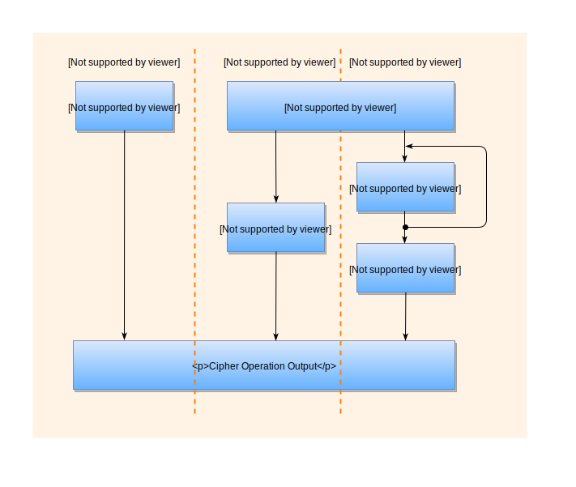

# Overview

1. [Install Golang](https://golang.org/doc/install) and ensure that your cloned repository is in your GOPATH.
2. Update the following information in the [examples/server_test.go](examples/server_test.go#L20) file.  

	*NOTE: This information can obtained by logging in to your IBM Cloud account and viewing your Hyper Protect Crypto Serverices (HPCS) instance and IAM information. See the [GREP11 API documentation](https://test.cloud.ibm.com/docs/services/hs-crypto?topic=hs-crypto-grep11-api-ref) for more information about GREP11*.

	```Golang
	// The following IBM Cloud items need to be changed prior to running the sample program
	const address = "<grep11_server_address>:<port>"

	var callOpts = []grpc.DialOption{
		grpc.WithTransportCredentials(credentials.NewTLS(&tls.Config{})),
		grpc.WithPerRPCCredentials(&util.IAMPerRPCCredentials{
			APIKey:   "<ibm_cloud_apikey>",
			Endpoint: "<https://<iam_ibm_cloud_endpoint>",
			Instance: "<hpcs_instance_id>",
		}),
	}
	```
		
3. `cd $GOPATH/src/github.com/ibm-developer/ibm-cloud-hyperprotectcrypto/golang/examples`
4. Execute the examples by issuing the command: `go test -v`
5. The sample program produces output similar to the following:

    ```Bash
	=== RUN   Example_getMechanismInfo
	--- PASS: Example_getMechanismInfo (0.02s)
	=== RUN   Example_encryptAndDecrypt
	--- PASS: Example_encryptAndDecrypt (0.03s)
	=== RUN   Example_digest
	--- PASS: Example_digest (0.02s)
	=== RUN   Example_signAndVerifyUsingRSAKeyPair
	--- PASS: Example_signAndVerifyUsingRSAKeyPair (0.66s)
	=== RUN   Example_signAndVerifyUsingECDSAKeyPair
	--- PASS: Example_signAndVerifyUsingECDSAKeyPair (0.04s)
	=== RUN   Example_signAndVerifyToTestErrorHandling
	--- PASS: Example_signAndVerifyToTestErrorHandling (0.04s)
	=== RUN   Example_wrapAndUnwrapKey
	--- PASS: Example_wrapAndUnwrapKey (0.65s)
	=== RUN   Example_deriveKey
	--- PASS: Example_deriveKey (0.11s)
	=== RUN   Example_tls
	--- PASS: Example_tls (0.05s)
	PASS
	ok  	github.com/ibm-developer/ibm-cloud-hyperprotectcrypto/golang/examples	1.667s
    ```

## General Function Call Workflow

GREP11 can perform encrypt, decrypt, digest, sign and verify operations. For each operation, there are a series of sub-operations or functions.  

For example, the *Encrypt* operation consists of *EncryptInit()*, *Encrypt()*, *EncryptUpdate()*, *EncryptFinal()* and *EncryptSingle()* sub-operations.

#### GREP11 sub-operations for Encrypt:

- *Encrypt***Init()** is used to initialize an operation

- *Encrypt()* is used to encrypt data without the need to perform *EncryptUpdate()* or *EncryptFinal()* sub-operations. *EncryptInit()* must be run prior to the *Encrypt()* call

- *Encrypt***Update()** is used to perform update operations as part of a multi-part operation

- *Encrypt***Final()** is used to perform final operations as part of a multi-part operation

- *Encrypt***Single()** is an IBM EP11 extension to the standard PKCS#11 specification and used to perform a single call without the need to use the **Init**, **Update**, and **Final** sub-operations

The following diagram shows the three calling sequence flows that can be used for *Encrypt*, *Decrypt*, *Digest*, *Sign* and *Verify* operations:

