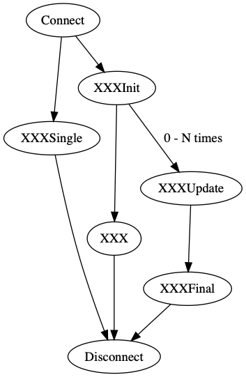

# Overview

1. [Install Golang](https://golang.org/doc/install)
2. [Change GREP11 server address](examples/server_test.go#L18) in `examples/server_test.go` file
3. cd `$GOPATH/src/github.com/ibm-developer/ibm-cloud-hyperprotectcrypto/golang/examples`
4. Execute the example by issuing the command `go test -v`
5. You will see similiar output as the following from the sample program:

    ```Bash
	=== RUN   Example_getMechnismInfo
	--- PASS: Example_getMechnismInfo (0.14s)
	=== RUN   Example_encryptAndecrypt
	--- PASS: Example_encryptAndecrypt (0.05s)
	=== RUN   Example_digest
	--- PASS: Example_digest (0.02s)
	=== RUN   Example_signAndVerifyUsingRSAKeyPair
	--- PASS: Example_signAndVerifyUsingRSAKeyPair (0.49s)
	=== RUN   Example_signAndVerifyUsingECDSAKeyPair
	--- PASS: Example_signAndVerifyUsingECDSAKeyPair (0.04s)
	=== RUN   Example_wrapAndUnwrapKey
	--- PASS: Example_wrapAndUnwrapKey (0.63s)
	=== RUN   Example_deriveKey
	--- PASS: Example_deriveKey (0.12s)
	=== RUN   Example_tls
	--- PASS: Example_tls (0.05s)
	PASS
	ok  	github.com/ibm-developer/ibm-cloud-hyperprotectcrypto/golang/examples	1.588s
    ```

## General function call workflow

Grep11 can do encrypt, decrypt, digest, sign and verify operations. For each operation, there are a series of functions. For example, It has `EncryptInit()`, `Encrypt()`, `EncryptUpdate()`, `EncryptFinal()` and `EncryptSingle()`. In general `XXXInit()` is used to initialize a operation; `XXXUpdate()` and `XXXFinal()` are used to perform mutiple function calls against long pieace of message; `XXXSingle()` is IBM ep11 extention to the standard PKCS#11 specification and used to perform a single call without `XXXInit()` call. The following graph script shows the three ways to calling sequence. The `XXX` could be `Encrypt`, `Decrypt`, `Digest`, `Sign` and `Verify`.



## Things to consider

This example does not use TLS. If you would like to experiment with TLS, review https://grpc.io/docs/guides/auth.html on how to implement TLS with GRPC.

## TODO

- The mock server needs to be implemented
- Implement language bindings for other languages